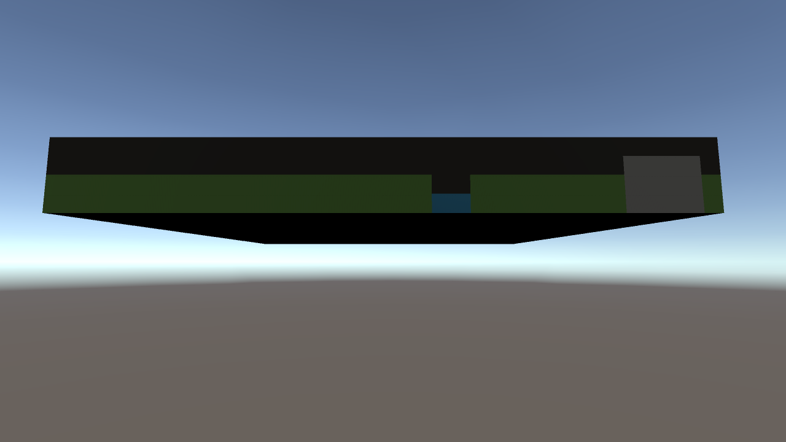
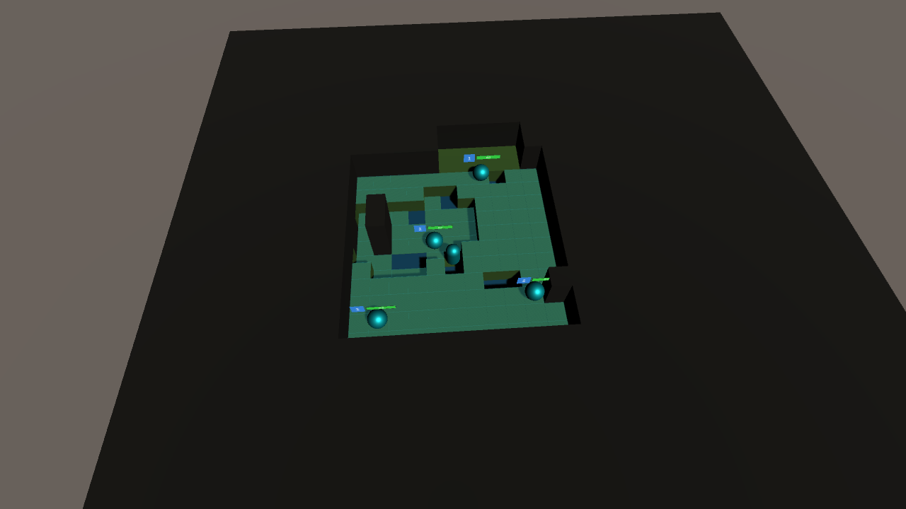

# 表示・操作バグ修正（2026-09-21）

- マップ下の崩れ: 下段の霧メッシュを地形に埋め込んでいたため、同一面の描画が競合していた。各セルの地表より上だけ霧を描くよう修正。同じ霧状態の隣接セル間では内部の側面を除去し、透明面の重なりも削減した。チャンク境界の状態変更時は隣接チャンクも更新する。
- 移動ポイントが消える: 回収済みオブジェクトが元の親に残り、再度回収すると同じ参照がプールに重複登録されていた。回収時にプール配下へ移し、二重回収を防止。再利用時のスケールもプレハブ値へ戻す。
- 移動後に視界が開かない: 移動確定時に明示的に視界を更新し、物理Transformを同期する。駒の現在地は必ず視界へ含める。山による視線遮断は維持する。
- 味方への攻撃ポイント: 通常攻撃・敵対象スキルは敵対関係で、味方対象スキルは同陣営で判定する。単なる「占有マス」判定をやめた。
- UIが駒の位置へ集まる: FindFirstObjectByType<Canvas> が駒の頭上WorldSpace Canvasを拾っていた。画面用Canvasの明示的な参照を用意し、メニュー、説明書、スキル選択、タイトル、ゲーム終了、Toastを接続した。

## 検証

Unity 6000.3.8f1 の隔離プロジェクトで実施。既存134項目と今回の216項目、合計350項目が成功。
今回の検証は、ポイントの生成・二重回収100サイクル、敵味方の攻撃表示切替、同一フレーム内の位置変更12回と霧の更新、メニューCanvas接続、地形下への霧の侵入を含む。

画像は実際のUnity Camera.Renderで生成し目視確認した。画面用Overlay UIはCamera.Render画像に含まれないため、UIの接続先は別途オブジェクト階層で検証した。

再現コードはTests~/VisualRegressionTests.cs。SceneSmoke.csとTerrainOptimizationTests.csと共に隔離コピーのAssets/Editorへ配置して実行する。元プロジェクトでSceneSmokeを直接実行しない。

全シード・長時間プレイ・全スキルの網羅検証ではない。ユーザーが変更中のAIThreatLevel.csは修正していない。

Windows x64通常ビルドも成功（BuildReport: errors=0, warnings=0）。検証用コピーでのビルドであり、配布用データではない。
